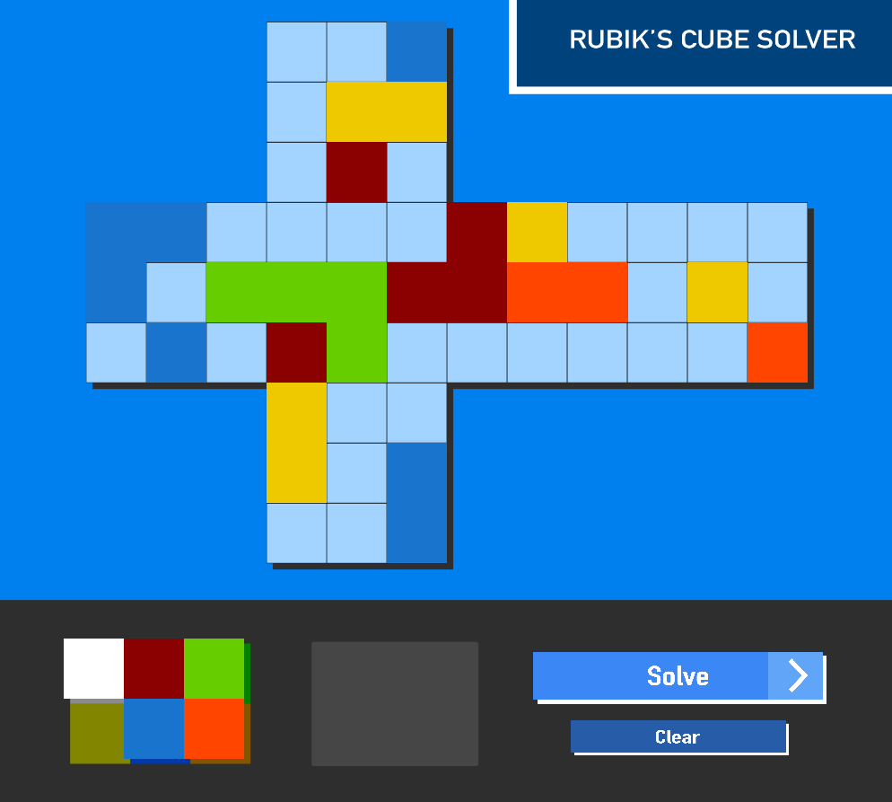
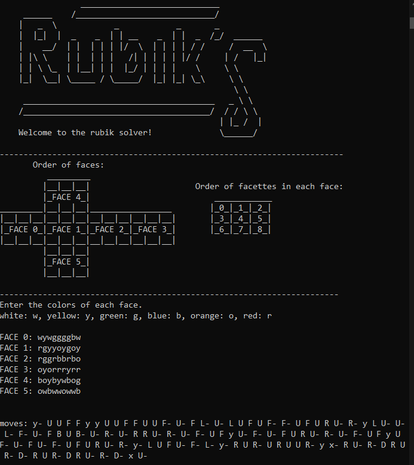

<div align="center">

# Rubik's cube solver
A **3x3** rubik's cube solver made with **python**.

---

The first two layers are solved using a home made algorithm (cf. Solving process), the last face is solved using the CFOP method. <br> <br> It doesn't use any external libraries to solve the cube, all the logic is implemented using **pure python**. 
</div>

---

<div align ="center">

### <span style="color: cornflowerblue"> 🚀 Run
</div>

```
pip install pygame
```
```
python gui.py
```
<p float="left">


</p>

<div align="center">

## <span style="color: cornflowerblue"> 📒 GUI Usage

</div>

### Give the layout of your cube
1. Click on a selector at the bottom left of the screen.
2. Click wherever you want to set the colour.
### Solve your cube
1. Press the solve button
2. The instructions will appear on the console according to the <a href=https://i.stack.imgur.com/8i7FQ.jpg>Singmaster notation</a> but with "-" for the counter-clockwise rotations.

If there is a problem with the colours you have given, then an error will be indicated in the console.
<br> <br>
⚠️ The cube must remain in the same position as you have defined. ⚠️

---

<div align="center">

## <span style="color: cornflowerblue"> 🎁 Content
The programm has been tested to work with 1369 different scrambled cases.
<br> <br>
In each case the cube was mixed with a random sequence of movements and the program successfully solved the cube. 
These cases were provided by the tester in about 3 minutes. And are in the test_cases.txt file.
</div>
 
| GUI| text-based UI | tester | 
|:--:|:--:|:--:|
| A graphical user interface made with pygame.| A text-based interface created using pure python. | An infinite loop which tries to solve the cube previously scrambled with a random sequence, if the cube is solved then it tries another one. Useful to debug the program.
<span style="color: ; font-size: 15px;">gui.py</span>|<span style="color: ; font-size: 15px;">terminal_ui.py|<span style="color: ; font-size: 15px;">tester.py</span>

<div align="center">

## <span style="color: cornflowerblue"> 🛠️ How does it work 
Home made algorithm for the first two layers and a simplified CFOP, simplified Fridrich method for the last layer.

</div>
 
### First cross
1. **white** center down
   
    a) **red** center in front
        **/** **white-red** edge in the bottom-front position

    b) **green** center in front
        **/** **white-green** edge in the bottom-front position

    c) **orange** center in front
        **/** **white-orange** edge in the bottom-front position

    d) **blue** center in front
        **/** **white-blue** edge in the bottom-front position

### F2L (first two layers)
for each color in (blue, red, green, orange)
1. **blue** center in front

    a) **white-red-blue** corner in the top right position
    
    b) correct corner correctly placed in the bottom right position
    
    c) place correct edge

### Last cross
Solve the last cross according to 4 different cross' states.

### OLL (orient last layer)
Solves the cube according to 7 different cases. (OLL cross)

### PLL (permute last layer)
Solves the pll according to 21 pll cases.

### Rotate last layer
Turns the last layer, the pll sometimes leaves one face to turn.

---

<div align="center"> 
  
## ⚠️ Dependencies

</div>
**python 3.10**
### Minimum files/folders required 
#### To use the gui only
| gui.py | solver_utils | gui_utils
|:------:|:------------:|:--------:|

#### To use the text ui only
| terminal_ui.py | solver_utils |
|:--------------:|:------------:|

```
                ______________________________
     ______    /_____________________________/
    |   _  \            _            _       _
    |  |_|  |  _    _  | | __    _  | |  _  /_/  ______
    |    __/  | |  | | | |/  \  | | | | / /     /  __  \  
    | |\ \    | |  | | |   /| | | | | |/ /     | /   |_|
    | | \ \_  | |__| | |  |_/ | | | |    \     \ \ 
    |_|  \__| \______/ \_____/  |_| |_| \_\     \ \ 
                                                 \ \ 
     ________________________________________   _ \ \ 
    /_______________________________________/  / / \ \ 
                                              | |_ /  | 
                                              \______/ 
```